#### 一、SVN概述

##### 1、为什么需要SVN版本控制软件

+ 协作开发
+ 远程开发
+ 版本回退

  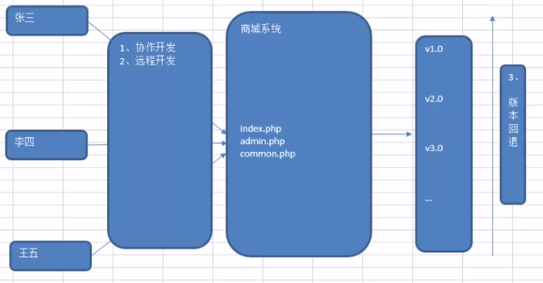

##### 2、解决之道

+ SCM：软件配置管理
  + 所谓的软件配置管理实际就是对软件源代码进行控制与管理
+ CVS：元老级产品
+ VSS：入门级产品
+ ClearCase：IBM公司提供技术支持
+ SVN：主流产品

#####  3、什么是SVN

+ 代码版本管理工具；它能记住你每次修改的代码；查看所有的修改记录；恢复到任何历史版本；恢复已经删除的文件

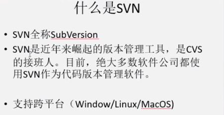

+ 特点：
  + 操作简单，入门容易
  + 支持跨平台操作（Window、Linux、MacOS）
  + 支持版本回退功能（时间机器）

##### 5、和Git比，有什么优势

+ 使用简单，上手快
+ 目录级权限控制，企业级安全必备
+ 子目录chenckout，减少不必要的文件检出

##### 6、主要应用

+ 开发人员用来做代码的版本管理
+ 用来存储一些重要的文件，比如合同
+ 公司内部文件共享，并且能按目录划分权限

####  二、工作流程

#### 三、获取SVN软件

+ 属于C/S结构软件（客户端与服务端）
+ 服务端(仓库)：
  + 软件VisualSvn，网址：http://www.visualsvn.com/
  + svnbucket.com：svnbucket最好用的svn服务（账号：JIAjia_hjj）
+ 客户端软件：
  + window安装TortoiseSVN，网址：https://tortoisesvn.net/downloads.html
  + MAC安装Corstone

#### 四、SVN服务器端软件安装（VisualSVN）

+ 服务端软件存储于软件/服务器端

#####  1、安装步骤

+ 双击服务端软件

+ 下一步，继续

  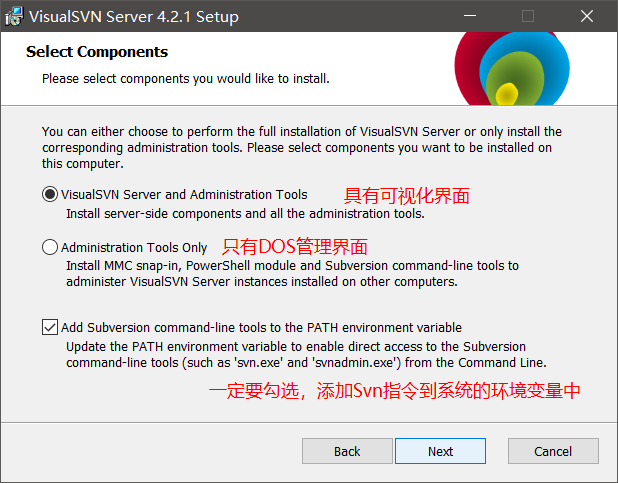

+ 下一步，继续

  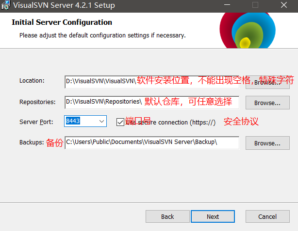

##### 2、SVN服务器端配置

+ 创建一个项目

  + 首先在SVN服务端创建一个公有目录WebApp作为项目目录

  + 在WeApp目录下创建Shop文件夹，作为Shop（版本仓库）

    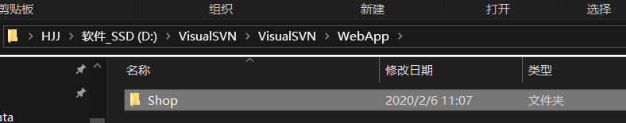

  + 创建版本仓库，Dos环境基本语法：**`svnadmin create Shop`** 文件夹路径（Shop 仓库）

    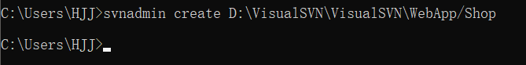

    (如果Shop仓库配置成功，那么Shop文件夹会显示以下目录结构)

    

+ 进行服务器端监管

  + Apache->http://localhost或(ip地址)访问到htdocs目录下相关文件（服务器端监管）

  + svn如何让客户端可以访问到服务器端的文件呢

  + SVN->svn://locallhost或(ip地址)访问到相关数据仓库(如Shop仓库)

  + 基本语法：**`svnserve -d(后台运行) -r(监管目录) 版本仓库路径`**

  + 如下图：

    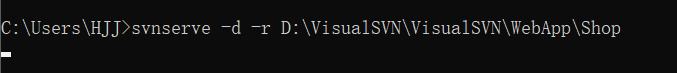

    通过以上指令，我们的svn://localhost或ip地址就可以直接指向Shop版本仓库。（在客户端输入svn://localhost，可以访问到Shop下的相关数据）

+ 权限控制

  + 默认情况下，SVN服务器是不允许匿名用户上传文件到服务端的，所以必须更改项目的相关配置文件。

    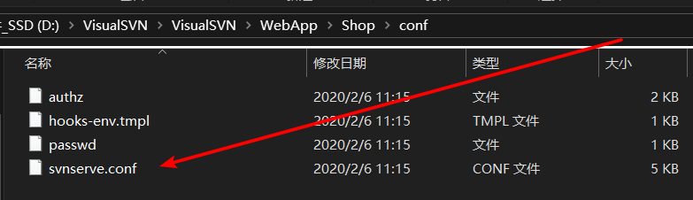

    更改第19行代码，去除前面的空格以及'#'，更改'read'(只可读)为'write'(可读可写)

    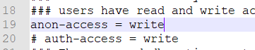

#### 五、SVN客户端软件安装（Tortoisesvn）

+ Tortoisesvn安装，一直下一步傻瓜式安装。注：安装完成后要，要重启计算机，否则右键svn小图标没法出现。

+ 汉化语言包安装，安装后TortoiseSVN->setting进行设置（安装时最后一步选择同意应用）。

+ 使用客户端软件连接SVN服务器

  + checkout检出：首先在你的项目目录鼠标右键->TortoiseSVN->版本库浏览器->输入SVN服务器地址

    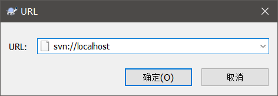

  + svn://SVN服务器地址->Shop项目(仓库)

    

  + 显示隐藏文件：如果出现.svn隐藏文件夹，代表检出成功

  + 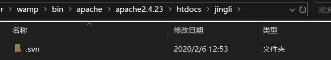

#### 六、SVN使用详解

##### 6.1.客户端基本操作

+ （注：做这些操作要启动svn服务器 D:\VisualSVN\VisualSVN\WebApp\Shop==>要想成一个真实的svn服务器，启动：**`svnserve -d(后台运行) -r(监管目录) 版本仓库路径）**

+ 检出操作Checkout：
  + 链接到SVN服务器端
  + 更新服务端数据到本地
  + 注：checkout只在第一次链接时候操作一次，以后如果进行更新操作请使用Update(更新指令)
  
+ 提交操作Commit：提交本地的数据到服务器

+ 以上工作是由项目经理完成的，新来程序员李四

  + 李四：检出操作->完成任务做提交操作
  + 项目经理：更新操作Update

+ 忽略功能

  

+ svn基本操作：checkout检出；add新增；commit提交；update更新；历史记录

+ 撤销本地的修改、撤销已提交的内容、恢复到指定版本

  - 撤销本地的修改：TortoiseSVN->SVN还原      提交->查看内容->发现错误还原掉
  - 撤销已提交的内容：   TortoiseSVN->显示日志->点那个记录右键->复原此版本作出的修改   只在本地作出的修改，还需要提交到服务器端上
  - 恢复到指定版本     TortoiseSVN->显示日志->点要复原法那个版本右键->复原到此版本

+ 添加忽略文件：

  + TortoiseSVN->去除版本控制并添加到忽略列表（x项目目录的修改 仅属性改变）
  + 又不想忽略：TortoiseSVN->从忽略列表中删除

+ xshell远程连接服务器的一款工具

+ svn追加到系统中随着window的启动而启动

+ 什么情况会发生冲突？

  + 多个人修改了同一个文件同一行
  + 无法进行合并的二进制文件

+ 怎么避免冲突？

  + 提交之前先更新可以避免冲突，经常update同步他人代码
  + 二进制文件不要多个人同时操作

+ 发生冲突了怎么办？

  + 解决冲突：点击冲突文件->使用他们的文本解决冲突   或  使用我的解决冲突的文件
  + 点击冲突文件->编辑冲突 我的文件和远程文件进行对比 不知道怎么合并的那一行显示红色  那边正确可以点击右键，使用此版本块->解决完 标记为已解决
  + 二进制解决冲突：2.点击冲突文件->使用他们的文本解决冲突   或  使用我的解决冲突的文件（选择远程）

##### 6.2.分支

+ 什么时候需要开分支？

  + 隔离线上版本和开发版本

  + 大功能开发，不想影响到其他人，自己独立开个分支去开发

+ svn典型的目录结构

  + trunk 主干，开发中的文件，在主干上开发，开发完成后开分支
  + branche  分支
  + tag 标签

+ 分支实现线上和线下版本.png

  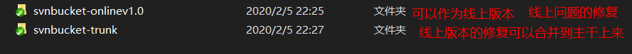

+ 主干和分支的修改是相互不会影响的

+ 选中主干的目录去开分支。存在问题分支越来越多，需要更新的内容越来越多，所以将分支单独check out一份出来

+ 新建分支

  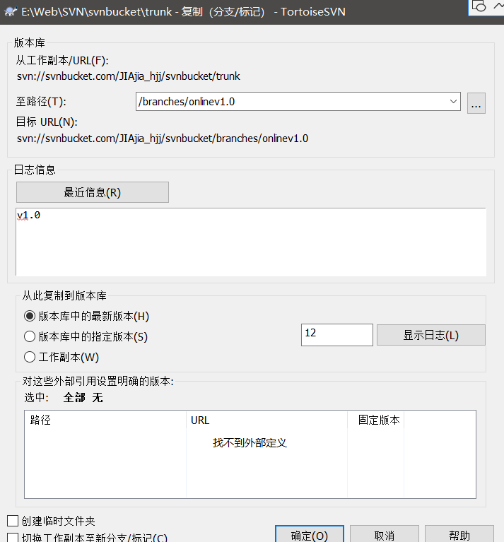

+ 线上版本（即分支）合并到主干上来：TortoiseSVN->点击要合并的版本(右键)->合并版本到(选中trunk文件)

  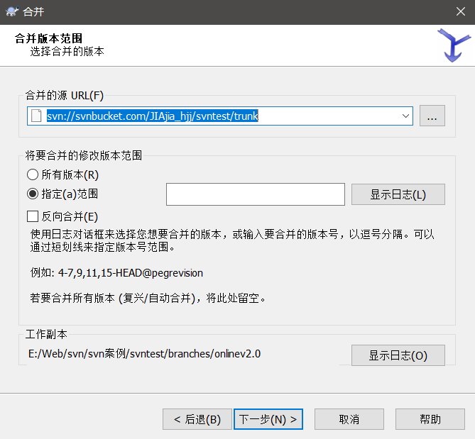

+ 线上版本切换分支

  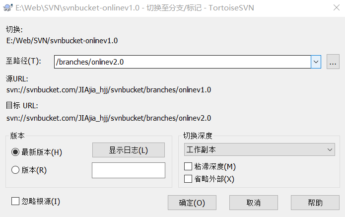

#### 七、配置多仓库

+ 在实际项目开发中，我们可能会同时开发多个项目，那么我们怎么监管呢？

  + 通过svnserve进行仓库监管，但是监管指令只能监管某个文件夹，而不能同时监管多个仓库

  + 可以通过监管WebApp总目录来达到监管所有仓库的目的

  + **`svnserve -d(后台运行)  -r(监管目录)  WebApp(项目总目录)`**

  + 打开DOS窗口，输入如下指令

    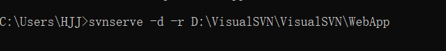

  + svn://localhost或ip地址来访问D:\VisualSVN\VisualSVN\WebApp目录

  + 如果需要访问Shop项目、Webchat项目

    + Shop项目：svn://localhost/Shop
    + Wechat项目：svn://localhost/Wechat

#### 八、权限控制

+ 使用权限控制的前提：必须先开启权限功能

+ 在每一个仓库中都有一个conf文件夹，里面有四个文件

  + authz文件：授权文件，告诉哪些用户具有哪些权限

  + passwd文件：认证文件，标识当前svn系统中某个仓库具有哪些用户以及相关密码

  + 默认情况下，以上两个文件都是禁用的，如果需要使用，首先要开启以上两个文件

  + 开启步骤如下：

    + 在配置文件svnserve.conf 中，注释匿名可读可写权限

      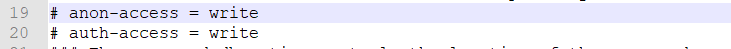

    + 在配置文件svnserve.conf 中，开启认证文件与授权文件

      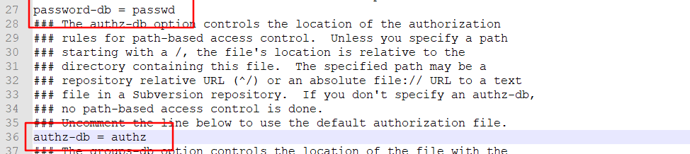

    + 编写认证文件(passwd)定义相关用户名和密码

      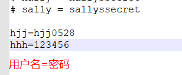

    + 编写授权文件(authz）

      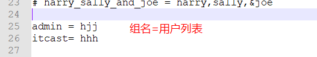

      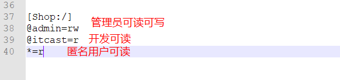

    + 测试

      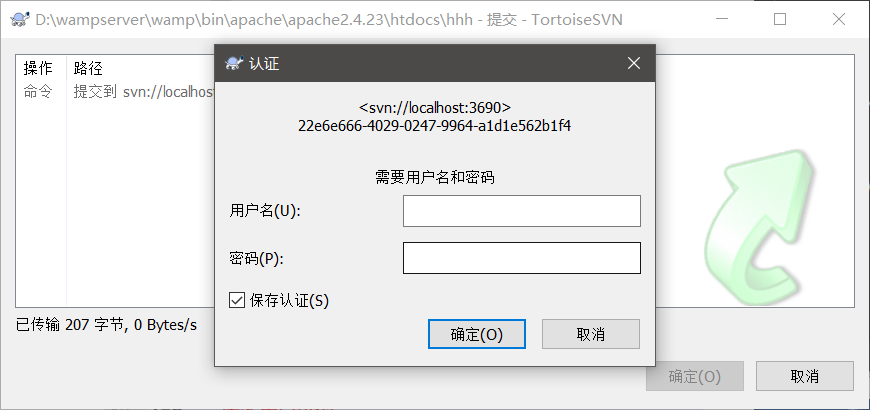

      输入hjj=hjj0528，可提交，输入hhh=123456不行

#### 九、SVN 服务的配置与管理

##### 1、配置自启动服务

+ sc create 服务名称 binPath=空格"D:\VisualSVN\VisualSVN\bin\svnserve.exe --service -r D:\svnroot"  start=空格auto

+ sc create SVNService binPath= "D:\VisualSVN\VisualSVN\bin\svnserve.exe --service -r D:\VisualSVN\VisualSVN\WebApp" start= auto

+ 创建系统服务器，服务名SVNService

  + 打开运行，输入cmd指令，打开DOS环境(使用超级管理员运行)

  + 输入一下指令，创建系统服务器

    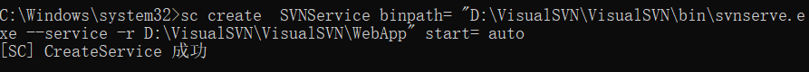

  + 查看系统服务，控制面板->管理工具->服务(或ctrl+R输入services.msc)

    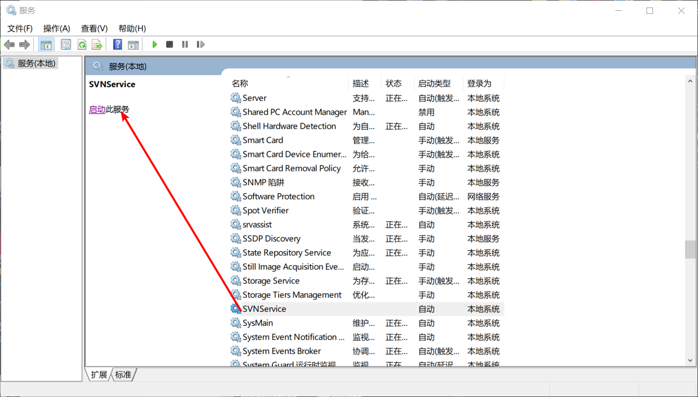

    如果运行成功代表开启SVN监管服务

+ 创建批处理文件

  + 启动服务 net start 服务名称
  
  + 停止服务 net stop 服务名称
  
  + 删除服务  sc   delete 服务名称
  
  + 以上功能在实际项目开发中经常使用，所以可以封装为.bat批处理文件，效果如下:
  
    

#### 十、模拟真实的开发环境

##### 1、SVN工作流程

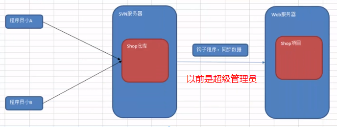

##### 2、钩子程序

+ 所谓钩子程序就是与一些版本库事件触发的程序，例如新修订版本的创建，或是未版本化属性的修改。

+ 默认情况下，钩子的子目录(版本仓库/hooks/)中包含各种版本库钩子模板。

  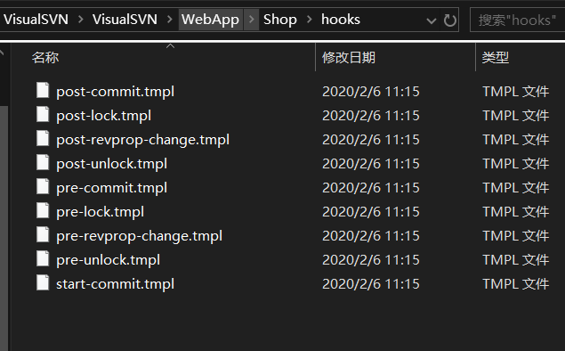

+ post-commit.tmpl：事务完成后所触发的钩子程序
+ 钩子程序默认情况可以采用批处理指令或Shell指令来进行编写

+ 通过批处理指令编写钩子程序

  + 指令svn服务端工作目录
    + 设置服务器端SVN路径：SET SVN="D:\VisualSVN\VisualSVN\bin\svn.exe"
  + 指定web服务器工作目录
    + 设置服务端项目运行目录：SET DIR="E:\Web\SVN\shop"
  + 通过update指令实时更新数据到DIR目录
    + SVN update %DIR%
    + SET SVN="D:\VisualSVN\VisualSVN\bin\svn.exe"
      SET DIR="E:\Web\SVN\shop"
      SVN update %DIR%

+ 具体使用步骤

  + 第一步：复制post-commit.tmpl为post-commit.bat文件

  + 第二步：填入相关批处理指令

    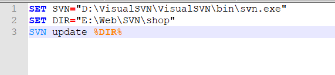

  + 第三步：在目录'E:\Web\SVN\shop'目录下创建shop项目并更新SVN服务端数据到本地

  + 第四步：更新文件到SVN服务器端，可以在shop目录实时获取到最新数据

  + 第五步：可以通过虚拟主机形式直接访问更新文件

    （http://localhost/shop/hooks.php，访问失败了）

#### 十一、SVN扩展程序

+ BAE云引擎

  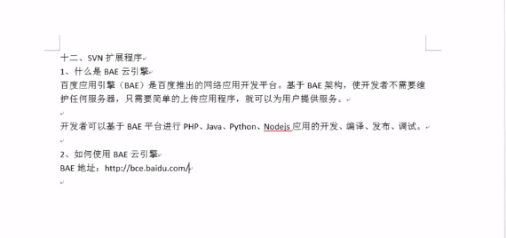

